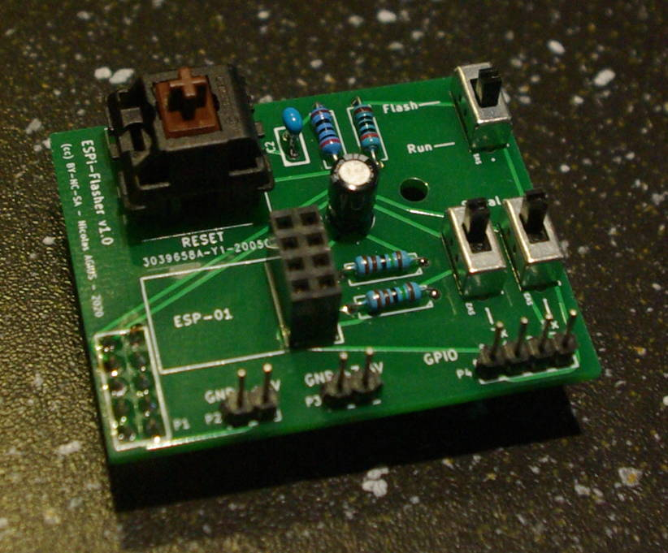
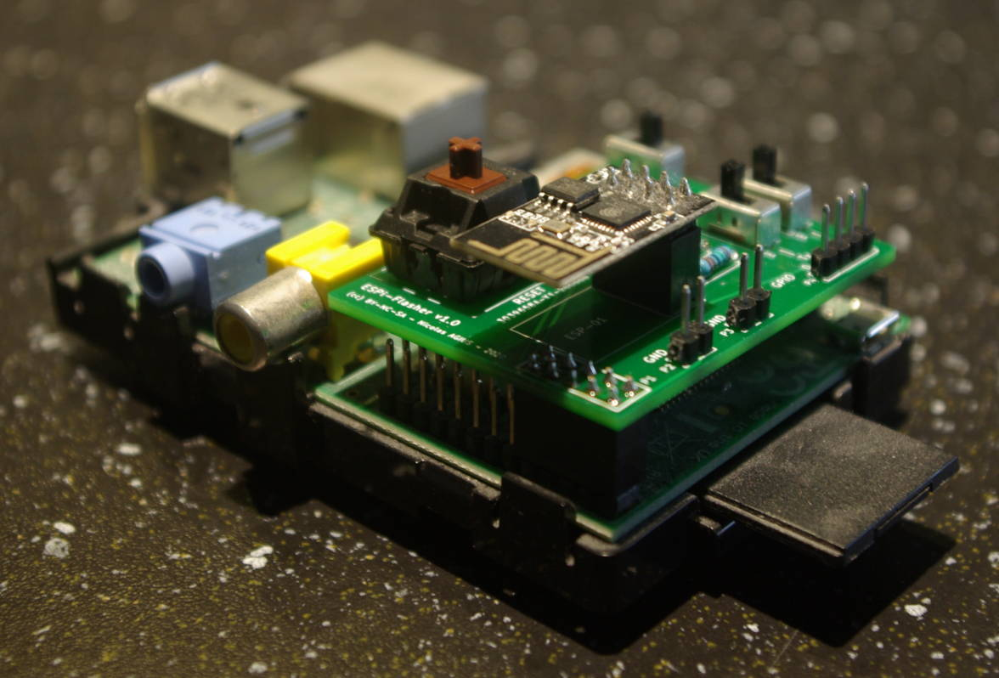

# ESPi-Flasher

ESPi-Flasher is a development board for ESP8266-01 as a Raspberry Pi HAT.



It enables you to easily flash an ESP8266-01 from the Raspberry using the onboard 3.3v serial port.
Additional headers for GPIO and power rails (5v and 3.3v) are provided on the side of the hat to plug a breadboard or other testing devices.

## Component list

All the needed gerber files are in the [gerber](gerber/) directory. Create a zip of these files and send it to your manufacturer to print the PCB.

|Ref|Component|
|---|---|
|P1| 5x2 female header to be soldered up side down|
|U2| 4x2 female header for ESP8266-01|
|C1| 47µF capacitor|
|C2| 100nF capacitor|
|R1, R4| 200 ohms resistors|
|R2, R3| 1.47k ohms resistors|
|SW1, SW2, SW3| SPDT switch (ref. OS102011MS2QN1)|
|SW4| Cherry MX switch or equivalent|

## Usage

Plug the hat on top of the Raspberry Pi. P1 must be plugged at the top of the Pi header, on pins 1 to 10. 
The mounting hole should match the one on the Raspberry board.



### Flash mode

Slide SW2 and SW3 to the *Serial* position and SW1 to *Flash*. Then press the Reset button.

You can now use the Arduino IDE to flash it on the serial port `/dev/ttyAMA0`.
If your Raspberry is headless, copy the firmware via SSH and flash it with Esptool:

```
esptool.py --port /dev/ttyAMA0 write_flash -fm qio 0x00000 MyFirmware.ino.generic.bin
```

### Run modes

Slide SW1 to the *Run* position and press Reset.

Only GPIO 0 and 2 will be available, Tx and Rx remains connected to the serial port for debugging. You can access this port from the Raspberry with :

```
minicom -D /dev/ttyAMA0

```

#### If you need 3 GPIOs

Slide SW1 to the *Run* position, SW3 to *GPIO* and press Reset.

This code will need to be added in your sketch :

```
Serial.begin(115200, SERIAL_8N1, SERIAL_TX_ONLY);
pinMode(3,FUNCTION_3);

```

GPIO 3 will be accessible as a standard GPIO but the Tx pin remain connected to the serial port for write-only logging. (Useful for debugging)

#### If you need 4 GPIOs

Slide SW1 to the *Run* position, SW2 and SW3 to *GPIO* and press Reset.

All calls to `Serial.*` must be removed or commented out in your code, and this snippet need to be added :

```
pinMode(1,FUNCTION_3);
pinMode(3,FUNCTION_3);
```

All 4 GPIO pins are available as standard GPIO. Serial interface is not available anymore.

##  License

Copyleft 2020 - Nicolas AGIUS
Creative Commons - Attribution-NonCommercial-ShareAlike 4.0 International (CC BY-NC-SA 4.0)


